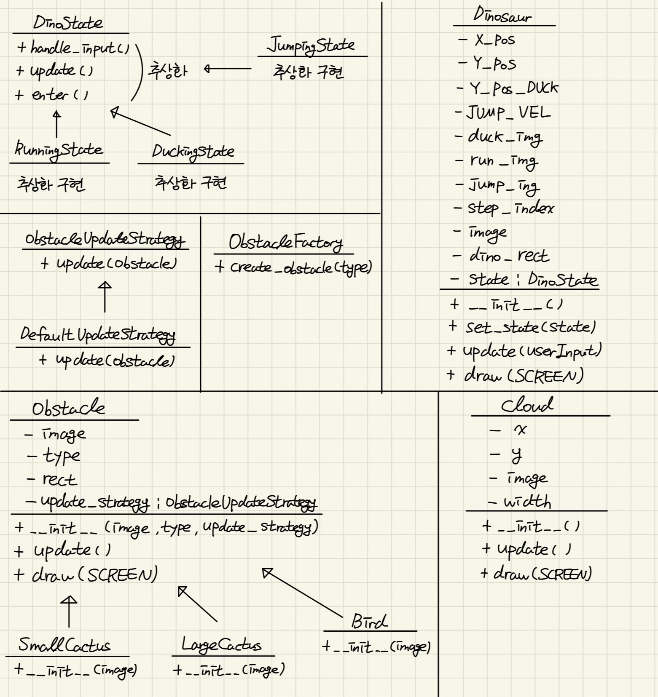

# DesignPattern_Dinosaur_Game
설계패턴 Dinosaur Game Refactoring

## Class Description
1. DinoState : 상태 패턴의 추상 크래스, 공룡의 상태(달리기, 앉기, 점프하기)를 나타내는 구체적인 상태 클래스들의 부모 클래스
- handle_input(dino, userInput): 상태 전환을 처리하는 메서드.

- update(dino): 상태 업데이트를 처리하는 메서드.

- enter(dino): 상태에 진입할 때의 초기화 작업을 처리하는 메서드.

2. RunningState, DuckingState, JumpingState: DinoState를 상속받는 구체적인 상태 클래스들로, 각기 다른 공룡의 상태를 나타냅니다.

- enter(dino): 상태에 진입할 때 초기화 작업을 수행합니다.

- handle_input(dino, userInput): 상태 전환을 처리합니다.

- update(dino): 상태 업데이트를 처리합니다.

3. Dinosaur: 공룡 클래스. 상태 패턴을 사용하여 공룡의 상태를 관리합니다.

- 속성:

  - X_POS, Y_POS, Y_POS_DUCK, JUMP_VEL: 공룡의 위치와 점프 속도.
  
  - duck_img, run_img, jump_img: 공룡의 이미지 리스트.

  - step_index, image, dino_rect, state: 공룡의 현재 상태와 이미지 정보.

- 메서드:

  - __init__(): 공룡 객체를 초기화합니다.

  - set_state(state): 공룡의 상태를 설정합니다.

  - update(userInput): 상태를 업데이트합니다.

  - draw(SCREEN): 공룡을 화면에 그립니다.

4. ObstacleUpdateStrategy: 전략 패턴의 추상 클래스. 장애물의 업데이트 로직을 정의합니다.

- update(obstacle): 장애물을 업데이트하는 메서드.

5. DefaultUpdateStrategy: ObstacleUpdateStrategy를 상속받는 클래스. 기본 장애물 업데이트 로직을 구현합니다.

- update(obstacle): 장애물의 위치를 업데이트합니다.

6. ObstacleFactory: 팩토리 패턴을 사용하여 장애물을 생성하는 클래스.

- create_obstacle(obstacle_type): 주어진 타입에 따라 장애물 객체를 생성합니다.

7. Obstacle: 장애물 클래스. 모든 장애물의 기본 클래스입니다.

- 속성:
  - image, type, rect, update_strategy: 장애물의 이미지, 타입, 사각형 영역, 업데이트 전략.

- 메서드:
  
  - __init__(image, type, update_strategy): 장애물 객체를 초기화합니다.

  - update(): 장애물을 업데이트합니다.

  - draw(SCREEN): 장애물을 화면에 그립니다.

8. SmallCactus, LargeCactus, Bird: Obstacle 클래스를 상속받는 구체적인 장애물 클래스들로, 각기 다른 종류의 장애물을 나타냅니다.

- __init__(image): 특정 타입의 장애물 객체를 초기화합니다.

9. Cloud: 구름 클래스. 구름 객체를 관리합니다.

- 속성:

  - x, y, image, width: 구름의 위치와 이미지 정보.

- 메서드:

  - __init__(): 구름 객체를 초기화합니다.

  - update(): 구름의 위치를 업데이트합니다.

  - draw(SCREEN): 구름을 화면에 그립니다.

## 클래스 다이어그램



`DinoState` 추상 클래스를 상속받아 구체적인 상태를 구현한 `RunningState`, `DuckingState`, `JumpingState` 클래스와 이를 사용하는 `Dinosaur` 클래스를 보여줍니다.

`Obstacle` 추상 클래스를 상속받아 구체적인 장애물 클래스를 구현한 `SmallCactus`, `LargeCactus`, `Bird` 클래스와 이를 생성하는 `ObstacleFactory` 클래스도 포함되어 있습니다.

또한, `ObstacleUpdateStrategy` 추상 클래스를 상속받아 장애물 업데이트 전략을 구현한 `DefaultUpdateStrategy` 클래스와 `Cloud` 클래스도 포함되어 있습니다.

## 사용된 패턴

### State Pattern (상태 패턴)
목적 : 객체의 내부 상태에 따라 행동을 변경할 수 있게 해줍니다. 객체는 자신의 클래스가 바뀐 것 처럼 행동합니다.

코드에서의 사용 : 
- 추상 클래스 DinoState: 공룡의 상태를 정의하는 기본 클래스입니다. 상태별로 처리해야 할 입력과 업데이트 메서드를 선언합니다.
```python
class DinoState:
    def handle_input(self, dino, userInput):
        pass

    def update(self, dino):
        pass

    def enter(self, dino):
        pass

```

- 구체적인 상태 클래스들 (RunningState, DuckingState, JumpingState): DinoState를 상속받아 각각의 상태에 맞는 행동을 정의합니다.
```python
class RunningState(DinoState):
    def enter(self, dino):
        dino.dino_run = True
        dino.dino_duck = False
        dino.dino_jump = False
        dino.image = dino.run_img[0]
        dino.dino_rect.y = dino.Y_POS

    def handle_input(self, dino, userInput):
        if userInput[pygame.K_UP]:
            dino.set_state(JumpingState())
        elif userInput[pygame.K_DOWN]:
            dino.set_state(DuckingState())

    def update(self, dino):
        dino.image = dino.run_img[dino.step_index // 5]
        dino.dino_rect.x = dino.X_POS
        dino.dino_rect.y = dino.Y_POS
        dino.step_index = (dino.step_index + 1) % 10
```

- Dinosaur 클래스: 공룡 객체가 현재 상태를 가지고 있고, 상태에 따라 행동을 변화시킵니다.
```python
class Dinosaur:
    def __init__(self):
        ...
        self.state = RunningState()
        self.state.enter(self)

    def set_state(self, state):
        self.state = state
        self.state.enter(self)

    def update(self, userInput):
        self.state.handle_input(self, userInput)
        self.state.update(self)
```

### Strategy Pattern (전략 패턴)
목적 : 특정 클래스의 알고리즘을 런타임에 변경할 수 있도록 합니다.

코드에서의 사용 : 
- 추상 클래스 ObstacleUpdateStrategy: 장애물 업데이트 전략을 정의합니다.
```python
class ObstacleUpdateStrategy:
    def update(self, obstacle):
        pass
```

- 구체적인 전략 클래스 DefaultUpdateStrategy: 기본 장애물 업데이트 로직을 구현합니다.
```python
class DefaultUpdateStrateg(ObstacleUpdateStrategy):
    def update(self, obstacle):
        obstacle.rect.x -= game_speed
        if obstacle.rect.x < -obstacle.rect.width:
            obstacles.pop()
```

- Obstacle 클래스: 장애물 객체가 업데이트 전략을 가지며, 이를 통해 장애물의 동작을 정의합니다.
```python
class Obstacle:
    def __init__(self, image, type, update_strategy):
        self.image = image
        self.type = type
        self.rect = self.image[self.type].get_rect()
        self.rect.x = SCREEN_WIDTH
        self.update_strategy = update_strategy

    def update(self):
        self.update_strategy.update(self)
```

### Factory Pattern (팩토리 패턴)
목적 : 객체 생성을 별도의 클래스로 분리하여, 객체 생성 과정을 캡슐화. 이를 통해 객체 생성의 복잡성을 줄임.

코드에서의 사용 : 
- ObstacleFactory 클래스: 주어진 타입에 따라 적절한 장애물 객체를 생성합니다.
```python
class ObstacleFactory:
    @staticmethod
    def create_obstacle(obstacle_type):
        if obstacle_type == "small_cactus":
            return SmallCactus()
        elif obstacle_type == "large_cactus":
            return LargeCactus()
        elif obstacle_type == "bird":
            return Bird()
```
